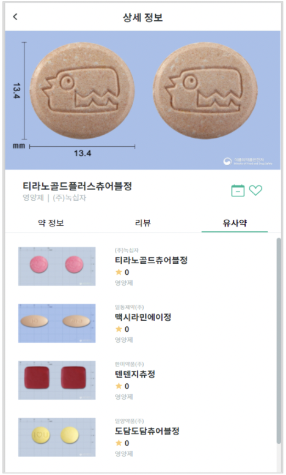
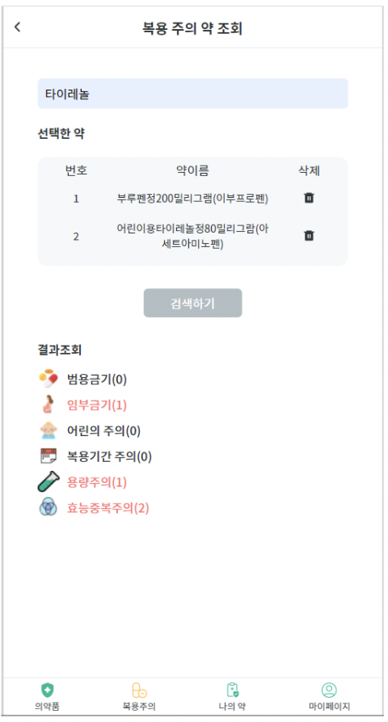
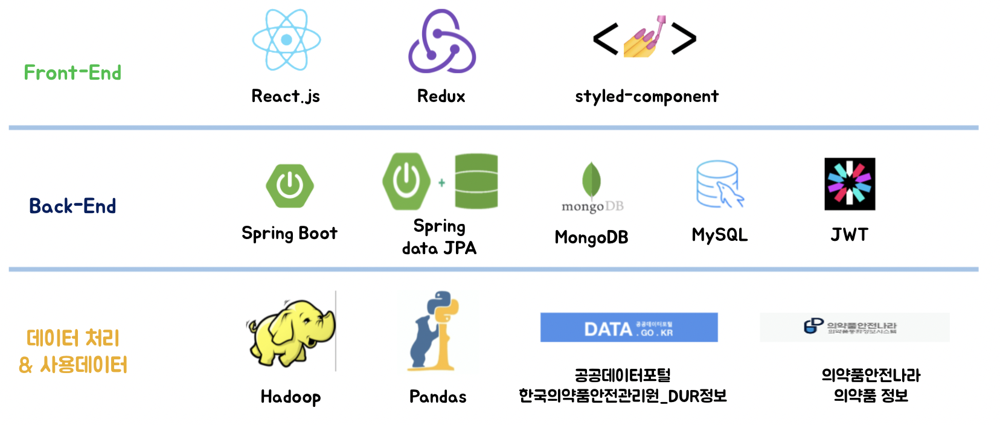
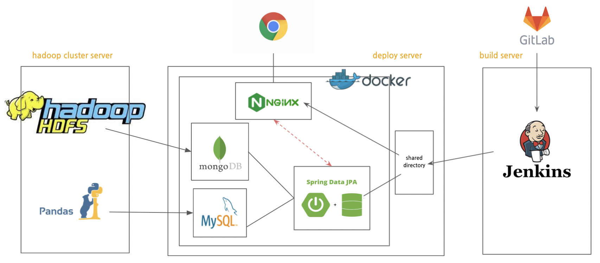

<hr>

## :bulb: Contributor
### Frontend: 곽나현, 남하은
### Backend: 심예은, 오웅식, 이지원, 진수연

<br>

## :heavy_check_mark: 개발 기간
### 2021.08.30 ~ 2021.10.08 (6주)
<br><br>

## :heavy_check_mark: 이게 뭐약?! 서비스 개요
- DUR ( Drug Utilization Review 의약품 적정사용)을 알기 쉽게 제공하는 서비스.
- `범용금기 의약품`, `효능 중복 주의` 또는 `임부`, `어린이`, `용량`, `투여시간` 별로 <br> 투여 시 주의해야 하는 의약품 정보를 알기 쉽게 제공합니다.

### 주요기능
### 1. 의약품 상세 정보 제공 서비스
<table>
    <tbody>
        <tr>
            <td rowspan=4>
            
            </td>
        </tr>
        <tr>
            <td>1. 공공 데이터로 제공되는 의약품 데이터를 활용해, 해당 의약품에 대한 상세 정보 제공</td>
        </tr>
        <tr>
            <td>2. 해당 의약품 사용자 리뷰 정보 제공</td>
        </tr>
        <tr>
            <td>3. 성분 유사도를 따져 현재 선택한 약과 유사한 의약품 정보 제공</td>
        </tr>
    </tbody>
</table>

### 2. DUR(범용금기) 의약품 정보 제공 서비스
<table>
    <tbody>
        <tr>
            <td rowspan=4>
            
            </td>
        </tr>
        <tr>
            <td>1. 선택한 의약품들을 조합한 결과 제공</td>
        </tr>
        <tr>
            <td>2. 조건에 따른 (연령별, 임부, 용량, 투여시간) <br> 투약 주의 약물 복용에 관련된 주의 사항 전달</td>
        </tr>
        <tr>
            <td>3. 범용금기(동시 복용), 효능 중복 주의 약물 복용에 관련된 주의 사항 전달</td>
        </tr>
    </tbody>
</table>

<br>

## :heavy_check_mark: 기술 스택 및 아키텍처


<br>



<br>

## :heavy_check_mark: 프로젝트 세팅 방법
- [Frontend](./frontend/README.md)
- [Backend](./backend/README.md)
- [Hadoop](./hadoop/README.md)

<br>

## :heavy_check_mark: 프로젝트 기여방법
### :rocket: Custom git flow
- 기존의 git flow 방식에서 우리의 프로젝트에 맞게 변경하였다.
- release를 삭제하고, fix라는 브랜치를 추가하였다.
1. **main**: 배포되었거나 배포될 소스가 저장되는 브랜치
2. **develop**: 다음 배포를 위해서 개발을 진행하는 브랜치, 개발 최신 상태를 항상 유지하도록 한다.
3. **hotfix**: 배포버전(main)에 생긴 문제로 긴급한 troubleshooting이 필요할 때 개발이 진행되는 브랜치
4. **feat**: 기능 단위 개발이 진행되는 브랜치
5. **fix**: 기능 개발이 끝난 후, 일어나는 이슈에 대한 처리가 진행되는 브랜치

- feat와 fix는 기능별로 depth를 타고 내려간다.

- 즉, feat와 fix branch를 만들 때는, <br> 1) **/** 뒤에 백엔드인지 프론트엔드 작업인지 정의한다. <br> 2) 그 다음 depth로 **/** 뒤에 처리하는 기능의 요약을 붙이도록 한다. <br>ex) feat/BE/signup , fix/FE/signup

- feat 와 fix branch에서 개발이 완료되면 parent인 develop branch로 merge된다.

- ***main branch에는 직접적으로 접근할 수 없다.***

<br>

### :rocket: Git convention
#### 1. Commit Message Format
- 모든 커밋 메시지는 다음과 같은 형식을 **반드시** 따르도록 한다.
```
<[BE] or [FE]> <type>: <message> <issue number>
```
- ex) <br> `[BE] feat: Add user login api #1`
<br> `[FE] fix: Fix bug to can't login using google login #2`
<br> `docs: Update README.md #3`

#### 2. BE / FE
|         type          |                 description                 |
| :-------------------: | :-----------------------------------------: |
|          BE           |         Backend 코드와 관련된 커밋          |
|          FE           |         Frontend 코드와 관련된 커밋         |
| X(아무것도 적지 않음) | Backend/Frontend와 관련없는 커밋 (ex. docs) |

#### 3. Type
|   type   |                                     description                                     |
| :------: | :---------------------------------------------------------------------------------: |
|   feat   |                            새로운 기능 구현에 대한 커밋                             |
|   fix    |                        수정 사항에 대한 커밋(ex. bug, typo)                         |
|   docs   |                       문서 작성에 대한 커밋(ex. 주석, README)                       |
|  style   | 간단한 수정 사항에 대한 커밋(ex. 코드 포맷팅, 세미콜론 누락, 코드 변경이 없는 경우) |
| refactor |                              코드 리펙토링에 대한 커밋                              |
|   test   |                              테스트 작성과 관련된 커밋                              |
|  chore   |                      위의 상황에 해당하지 않는 커밋(ex. 빌드 업무 수정, 패키지 매니저 수정)  |

#### 4. Message
- 커밋 메시지는 명령문으로 작성한다.
- 첫 글자는 대문자가 되도록 한다.

#### 5. Issue number
- 커밋과 관련된 이슈는 커밋 메시지 마지막에 **반드시** 연결하도록 한다.
- 지라에 등록된 이슈와 연동되도록 한다.
