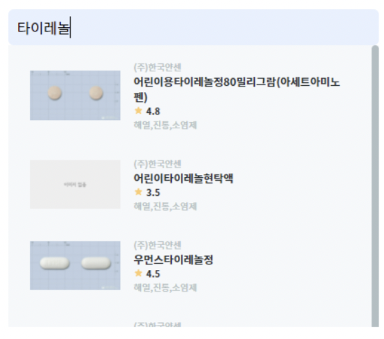

# 이게뭐약?! 시연 시나리오

## 1. 회원가입
<table>
    <tbody>
        <tr>
            <td rowspan=3>
            
            </td>
        </tr>
        <tr>
            <td>1. 이메일, 비밀번호, 닉네임, 생년월일, 성별 입력 후 회원가입을 한다.</td>
        </tr>
        <tr>
            <td>2. 성공적으로 회원가입이 완료되면 로그인하는 페이지로 이동한다.</td>
        </tr>
    </tbody>
</table>
 

## 2. 로그인
<table>
    <tbody>
        <tr>
            <td rowspan=3>
            
            </td>
            <td rowspan=3>
            
            </td>
        </tr>
        <tr>
            <td>1. 이메일과 비밀번호를 입력 후 로그인한다.</td>
        </tr>
        <tr>
            <td>2. 성공적으로 로그인이 완료되면 메인 페이지로 넘어간다.</td>
        </tr>
    </tbody>
</table>
 

## 3. 의약품 조회(메인 페이지)
<table>
    <tbody>
        <tr>
            <td rowspan=3>
            
            </td>
            <td rowspan=3>
            
            </td>
        </tr>
        <tr>
            <td>1. 검색창에서 약 이름을 검색하면  검색한 단어를 포함하는 의약품 정보를 리스트로 보여준다.</td>
        </tr>
        <tr>
            <td>2. 카테고리별로 의약품이 나누어져 있으며   각각의 카테고리를 클릭 시 의약품 정보를 리스트로 보여준다.</td>
        </tr>
    </tbody>
</table>
 

## 4. 상세 정보
- 리스트에서 하나의 의약품을 선택하면 상세정보를 볼 수 있다.
- 상세정보에서는 약 정보, 리뷰, 유사약을 볼 수 있다.
- 색이 채워져 있지 않은 하트 모양의 아이콘을 클릭하면 약바구니에 추가할 수 있고 하트에 색이 채워진다.
- 색이 채워져있는 하트 모양 아이콘을 클릭하면 약바구니에서 삭제할 수 있다.
- 캘린더 모양의 아이콘(+)을 클릭하여 복용 시작일을 입력한 후 설정 완료 버튼을 클릭하면 복용중인 약에 추가할 수 있다. 
- 캘린더 모양의 아이콘(-)을 클릭하면 `복용을 그만두시겠습니까?` 라는 메세지가 나타나고 확인버튼을 클릭하면 복용중인 약에서 삭제할 수 있다.

### 4-1) 약 정보
<table>
    <tbody>
        <tr>
            <td rowspan=2>
            
            </td>
        </tr>
        <tr>
            <td>약의 효능/효과, 용법/용량, 이상반응, 저장방법 정보를 제공한다.</td>
        </tr>
    </tbody>
</table>
 

### 4-2) 리뷰
<table>
    <tbody>
        <tr>
            <td rowspan=7>
            
            </td>
        </tr>
        <tr>
            <td>1. 약에 대한 총 평점을 볼 수 있다.</td>
        </tr>
        <tr>
            <td>2. 리뷰작성 아이콘을 클릭하여 리뷰를 작성할 수 있다.</td>
        </tr>
        <tr>
            <td>3. 작성되어 있는 리뷰를 볼 수 있다.</td>
        </tr>
        <tr>
            <td>4. 수정을 클릭해 평점이나 리뷰 내용을 변경할 수 있다.</td>
        </tr>
        <tr>
            <td>5. 삭제를 클릭해 작성한 리뷰를 삭제할 수 있다.</td>
        </tr>
        <tr>
            <td>6. 수정, 삭제는 사용자 자신이 작성한 리뷰만 가능하다.</td>
        </tr>
    </tbody>
</table>
 

### 4-3) 유사약
<table>
    <tbody>
        <tr>
            <td rowspan=3>
            
            </td>
        </tr>
        <tr>
            <td>1. 성분이 유사한 의약품의 정보를 성분이 많이 겹치는 순으로 제공한다.</td>
        </tr>
        <tr>
            <td>2. 약을 클릭하면 해당 약의 상세 정보 페이지로 이동한다.</td>
        </tr>
    </tbody>
</table>
 

## 5. 복용주의
<table>
    <tbody>
        <tr>
            <td rowspan=4>
            
            </td>
            <td rowspan=4>
            
            </td>
        </tr>
        <tr>
            <td>1. 드랍다운 박스로 검색하여 새로운 약을 추가할 수 있다.</td>
        </tr>
        <tr>
            <td>2. 범용금기, 연령별 금기, 효능 중복 주의,   용량 주의, 투여기간 주의에 관련된 정보를 제공한다.</td>
        </tr>
        <tr>
            <td>2. 결과가 길어질 경우를 대비해 항목별로 `>` 를 클릭해 접었다 폈다 할 수 있다. </td>
        </tr>
    </tbody>
</table>
 

## 6. 나의 약
<table>
    <tbody>
        <tr>
            <td rowspan=5>
            
            </td>
            <td rowspan=5>
            
            </td>
        </tr>
        <tr>
            <td>1. 약바구니와 복용중인 약 정보를 볼 수 있다.</td>
        </tr>
        <tr>
            <td>2. 의약품 이미지, 이름, 회사명, 리뷰점수, 카테고리 정보를 제공한다.</td>
        </tr>
        <tr>
            <td>3. 복용중인 약의 경우 복용 경과일을 볼 수 있다.</td>
        </tr>
        <tr>
            <td>4. 약바구니와 복용중인 약 모두 x를 클릭해 해당 항목에서 삭제할 수 있다.</td>
        </tr>
    </tbody>
</table>
 

## 7. 내가 쓴 리뷰
<table>
    <tbody>
        <tr>
            <td rowspan=5>
            
            </td>
        </tr>
        <tr>
            <td>1. 내가 쓴 리뷰를 모아서 한번에 볼 수 있다.</td>
        </tr>
        <tr>
            <td>2. 수정을 클릭해 해당 리뷰를 수정할 수 있다.</td>
        </tr>
        <tr>
            <td>3. 삭제를 클릭해 해당 리뷰를 삭제할 수 있다.</td>
        </tr>
        <tr>
            <td>4. 리뷰전체삭제를 클릭해 내가 쓴 리뷰 전체를 한번에 삭제할 수 있다.</td>
        </tr>
    </tbody>
</table>
 

## 8. 마이페이지
<table>
    <tbody>
        <tr>
            <td rowspan=4>
            
            </td>
        </tr>
        <tr>
            <td>1. 닉네임과 이메일을 표시해주고,  톱니바퀴 아이콘을 클릭해 개인정보를 수정할 수 있다.</td>
        </tr>
        <tr>
            <td>2. 로그아웃을 클릭해 로그아웃할 수 있고,  로그아웃시 로그인 페이지로 이동한다.</td>
        </tr>
        <tr>
            <td>3. 회원탈퇴를 클릭하면   회원탈퇴 시 주의사항을 보여준 후, 탈퇴하기 버튼을 클릭해 탈퇴할 수 있다.</td>
        </tr>
    </tbody>
</table>
 